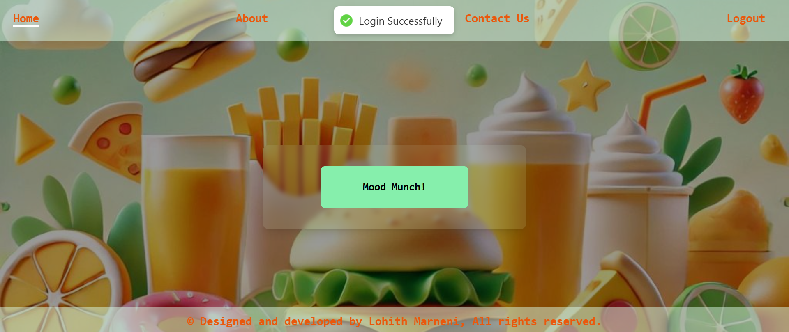

# Food with Mood 🍲😄

A full-stack web application built with the MERN stack (MongoDB, Express, React, Node.js) that provides users with personalized food recommendations based on their mood and personality traits. The app uses JWT authentication for secure login and customizes food suggestions based on answers to fun questions, creating a unique experience for each user.

## Table of Contents
- [Features](#features)
- [Tech Stack](#tech-stack)
- [Getting Started](#getting-started)
- [Usage](#usage)
- [Future Enhancements](#future-enhancements)
- [License](#license)

## Features
- **Personalized Food Recommendations**: Users receive tailored food suggestions based on mood and personality traits.
- **User Authentication**: JWT-based authentication for secure access to personalized recommendations.
- **User Data Storage**: Stores responses for refining future suggestions.
- **Responsive UI**: Provides a seamless experience across devices.

## Tech Stack
- **Frontend**: React, HTML, CSS, JavaScript, Tailwind CSS
- **Backend**: Node.js, Express.js
- **Database**: MongoDB
- **Authentication**: JSON Web Tokens (JWT)

## Getting Started
Follow these instructions to set up and run the project on your local machine.

### Prerequisites
- Node.js and npm installed
- MongoDB installed locally or a MongoDB Atlas account for a cloud-hosted database

### Usage

- **Sign Up / Login**: New users can create an account, while returning users can log in with their credentials.
- **Answer Questions**: Answer a series of fun questions to determine personalized food suggestions.
- **View Recommendations**: Based on your responses, the app will suggest three foods that best suit your current mood and personality.
- **Save and Improve Suggestions**: User responses are stored for refining future recommendations, creating a more tailored experience over time.
- **Go and try it**: [Visit the live app here](https://fm-mern-faj3vzdao-lohith-marnenis-projects.vercel.app/)

### Future Enhancements
- Mood Analysis with Sentiment Detection: Analyze user input to gauge mood more accurately.
- Enhanced Personalization: Allow users to adjust recommendations based on past feedback.
- Social Sharing: Enable users to share their food suggestions on social media.

### License
This project is licensed under the MIT License.
